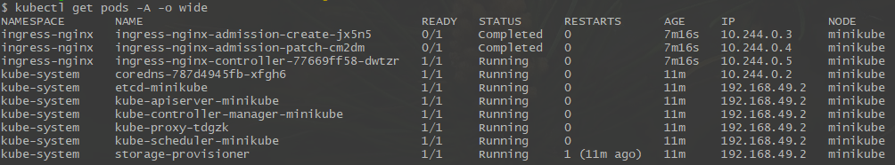
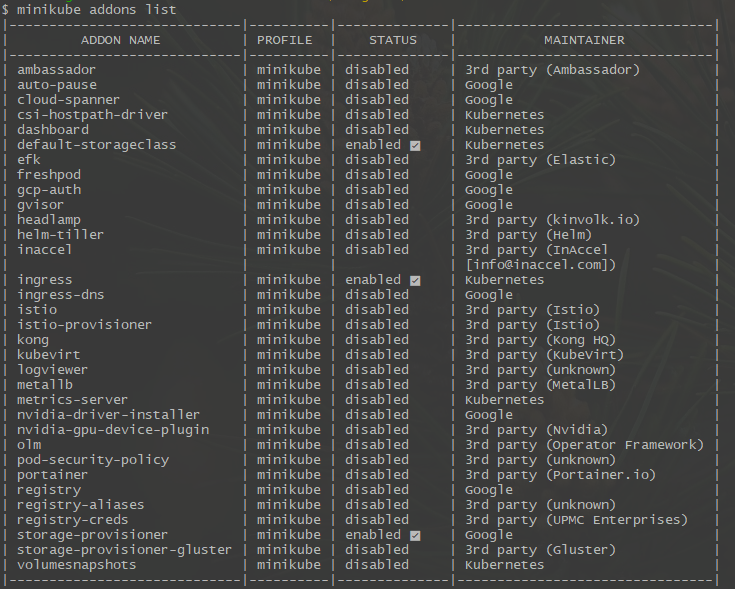

## Module 1

`kubectl get pods -A -o wide`


`minikube addons list | grep ingress`

  
  
### Required commands:
```bash
minikube start --disable-metrics=true --driver=docker \
    --memory='4g' --cpus='1' \
    --interactive=true
# Driver is one of: virtualbox, vmwarefusion, hyperv, vmware, qemu2, docker, podman (experimental), ssh; (defaults to auto-detect)

minikube status

kubectl config view

minikube addons enable ingress
minikube addons list

minikube tunnel
# tunnel creates a route to services deployed with type LoadBalancer and sets their Ingress to their ClusterIP.
# for a detailed example see https://minikube.sigs.k8s.io/docs/tasks/loadbalancer

kubectl config get-contexts
kubectl --context ${CONTEXT_NAME} --namespace ingress-nginx get pods

kubectl config get-contexts
kubectl config use-context ${CONTEXT_NAME}
kubectl config current-context

kubectl get ns
kubectl get pods -A -o wide


kubectl cluster-info
kubectl cluster-info dump
kubectl get nodes

kubectl get nodes -o wide
kubectl describe node NODE_NAME
kubectl drain NODE_NAME


kubectl get events
kubectl config view

K8S_SECRET_NAME='docker-secret'
kubectl create secret generic ${K8S_SECRET_NAME} \
    --from-file=.dockerconfigjson=$HOME/.docker/config.json \
    --type=kubernetes.io/dockerconfigjson

kubectl get secrets
kubectl describe secret ${K8S_SECRET_NAME}
kubectl get secret ${K8S_SECRET_NAME} -o jsonpath='{.data}'
kubectl edit secrets ${K8S_SECRET_NAME}
kubectl delete secret ${K8S_SECRET_NAME}


# Demo 1 Deployment
kubectl create deployment hello-minikube --image=kicbase/echo-server:1.0
kubectl expose deployment hello-minikube --type=NodePort --port=8080

kubectl get services
kubectl get services hello-minikube

echo 'Use either:'
minikube service hello-minikube
kubectl port-forward service/hello-minikube 7080:8080

# Demo 2 LoadBalancer
kubectl create deployment balanced --image=kicbase/echo-server:1.0
kubectl expose deployment balanced --type=LoadBalancer --port=8080

minikube tunnel

kubectl get services
kubectl get services balanced
```
